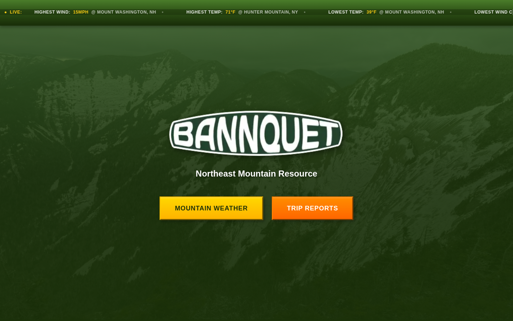

# Bannquet

Mountain weather and trip reports for the Northeast. Bannquet pulls National Weather Service forecasts for summits and valleys across the Adirondacks, Catskills, Shawangunks, Green Mountains, White Mountains and Maine's northern ranges, and lets people publish trip reports of their own.

Live at [bannquet.com](https://www.bannquet.com).



## What it does

- Hourly and daily forecasts, wind, precipitation and alerts for each mountain, grouped by region (NY, VT, NH, ME).
- A ticker at the top of the site showing the current extremes across regions.
- Trip reports written in a rich-text editor, with compressed image uploads, tags (hiking, climbing, skiing and so on) and an optional map pin.
- Reports go live only after the author verifies by email. The publish link expires after 24 hours, and the edit link does not expire.
- An embedded Sanity Studio for managing content.

More detail on the endpoints used is in `API_DOCUMENTATION.md`, and the Sanity setup steps are in `SANITY_SETUP.md`.

## Stack

Next.js 16 (App Router), React 19, TypeScript, Tailwind CSS 3, Framer Motion, Mapbox GL, TipTap, Sanity, Resend for email, and the NWS API for weather. Deployed on Vercel.

## Running it locally

You need Node.js 20 or newer.

```sh
npm install
npm run dev
```

Then open http://localhost:3000. Create a `.env.local` with these variables:

- `NEXT_PUBLIC_SANITY_PROJECT_ID` and `NEXT_PUBLIC_SANITY_DATASET`
- `SANITY_API_TOKEN`, an editor token used on the server for creating and uploading trip reports
- `RESEND_API_KEY` and `EMAIL_FROM` for the verification emails
- `NEXT_PUBLIC_MAPBOX_TOKEN` for the map pin picker
- `NEXT_PUBLIC_APP_URL`, for example `http://localhost:3000`, used to build the links in emails

Weather pages work without any keys because the NWS API is open. Submitting a trip report needs the Sanity and Resend values.

## Scripts

- `npm run dev` starts the dev server
- `npm run build` builds for production
- `npm run start` serves the production build
- `npm run lint` runs ESLint

The live-conditions socket server for the user map is a separate project, [bannquet-io](https://github.com/jakedcl/bannquet-io).
